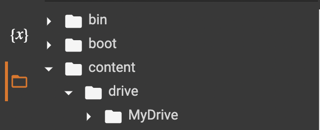

# Rename Raw Images

Renaming images is the first key step in this data processing pipeline. For our study, field camera traps in various watersheds at Hubbard Brook Experimental Forest took one photo each day over a time span of several years. The original file names were a non-descriptive series of numbers,
following this step, they will contain information about the watershed the photo
was taken at as well as time-series image metadata.

These steps were designed to process files stored in a shared Google Drive. Before renaming images contained in a local directory, modifications to the script will need to be made; 
however, the same general principles will still apply.

### Mount Google Drive

```{python, eval = FALSE}
# This will connect to your Google Drive. It will ask you to allow access
drive.mount('/content/drive', force_remount=True)

```


When using Google Colaboratory, before performing any file operations, you must *mount* your personal Google Drive. Find the code chunk with the above code in Colab and run it to allow access.

Afterwards, make sure all file paths used in any functions are for your Google Drive specifically. To find a pathname, click the orange file icon on Google Colab’s sidebar, and then click content to navigate your Google Drive. Right-click and select copy path to copy the pathname (see below).

```{r image, echo = FALSE}

#Update file path if needed - all images in imgs folder

```


## Copying Files

This preliminary step is used when a backup or copy of the original data is needed. It will copy all files in the source directory not present in the target directory. 

### Load Packages

Before each session, first run the top 3 lines – these lines of code install the *Tesseract Optical Character Recognition Engine*, which allows us to later use the `text_to_string` function and read the timestamp from each image. Subsequently, load all required packages/libraries.

```{python load-python-packages, eval = FALSE}
apt install tesseract-ocr
apt install libtesseract-dev
pip install pytesseract

import numpy as np
import pandas as pd
import re
import os
import shutil
from google.colab import drive
from glob import glob

```


### Copying Files

This method uses shutil’s `copytree` function, which blanket copies all files within a specified directory. To handle issues caused by direct copying of files versus copying of subdirectories, these are copied separate from each other within the code. 

```{python copy-files-method, eval = FALSE}

if missing_files == source_file_list: # Will copy entire source folder into destination when no subfolders/files are shared between the two
  shutil.copytree(source, destination + '/' + directory_name, ignore = shutil.ignore_patterns('*.gdoc', '*.gsheet', '*.gslides')) #1

else:
    for folder in missing_files: # Will copy all missing files/subfolders not present in the destination
      new_dst = destination + '/' + folder
      if os.path.isfile(folder) == False: # Copies all subfolders/subdirectories
        shutil.copytree(source + '/' + folder, new_dst, ignore = shutil.ignore_patterns('*.gdoc', '*.gsheet', '*.gslides')) #1
        missing_files.remove(folder)
      else: # Copies files not contained within a subdirectory
        shutil.copy(source + '/' + folder, destination)
        missing_files.remove(folder) 
    print("These folders/files were not copied (ignore if list is empty): ")
    print(missing_files)
  
```


Copying **any** Google files, be it Google Docs, Slides, Sheets, Drawings, etc. must be done manually as these files are special and not able to be copied using shutil^[For more information, see the comments within the script and text blocks in the Jupyter Notebook.]. For any additional file extensions to avoid copying, specify them as arguments for `shutil.ignore_patterns`.

### Main Method

Finally, to copy the files, simply call `copy_files` within the main method. This method takes 3 arguments – the file path for the source folder, the file path for the destination folder, and a folder name for the folder created if the source and destination directories share no files.  

```{python main-method, eval = FALSE}
args = ("/content/drive/MyDrive/Duke 2022-2023/Data+/2_Camera Trap photos/Stream Photos/On_Deck", "/content/drive/MyDrive/Duke 2022-2023/Data+/2_Camera Trap photos/COPY of data for script/On_Deck", "Newly_uploaded_data")
copy_files(*args)

```


## Renaming Files

The renaming files script takes advantage of the **Tesseract OCR Engine** to read
the time stamp on the image. This string is then parsed to generate time series
information. There are many complementary methods in this script; for more information,
see documentation within the script itself. 

Be sure to allocate time for the script to run, especially on folders containing
large amounts of image files^[If you are looking to reduce the script's runtime, one method
is to remove the loop within `extract_timeStamp` which searches multiple times for the
correct timestamp if it is not found initially. However, this will increase the number
of files which failed to be renamed correctly.] 

Additionally, the pixel parameters within `extract_timeStamp` are designed for
the images taken by the field cameras used in our study. These will have to be manually
*adjusted* for images with time series information contained elsewhere.


```{python extract-timestamp, eval = FALSE}

def extract_timeStamp(pic_address):
    '''
    Extract time Stamp from picture file.

    From the bottom right of each picture file, the time stamp is read as image using cv2. It is then converted to a string.
    text which is then checked for format and subsequently returned through match_date_format.

    Parameters
    ----------
    pic_address : full source address of current picture file.
    Returns
    -------
    match_date_format.group(0) : unaltered timeStamp from bottom of the photo as a string.
    '''
    # print(pic_address)

    img = cv2.imread(pic_address) #read as an image

    # check if the timestamp is the correct format
    date_pattern = "\d\d-\d\d-\d\d\d\d \d\d:\d\d:\d\d" # eg 12-12-2020 11:59:32

    loop = 1
    size_extension=0
    x,y,z = np.shape(img)
    x = (x//1000)*1000
    y = (y//1000)*1000
    # print(x,y,z)
    while loop>0:
      ts = img[2352 - size_extension:, 2000-size_extension:, :] #(change if sizing conventions change!)
      text = pytesseract.image_to_string(ts)
      match_date_format = re.search(date_pattern,text)
      if match_date_format:
        # found timestamp, return
        break
      ts_2 = img[x - size_extension:, x-size_extension:, :] #(change if sizing conventions change!)
      text_2= pytesseract.image_to_string(ts_2)
      match_date_format = re.search(date_pattern,text_2)
      if match_date_format:
        # found timestamp, return
        break
      size_extension+=100
      loop-=1

    if loop ==0:      
      # reached end of loop without finding correct timestamp
      print("Correct timestamp not found")

    else:
      return match_date_format.group(0)

```
  
As with before, make sure Google Drive is mounted, and all relevant packages/libraries are
imported. Then, update the file paths^[It may be a good idea to remove or make a note of any 
non-image files within the folder, as these will throw errors.] and run the main method (below).
  
```{python main-method-rename-images, eval = FALSE}
from glob import glob

#collect all folder paths from newly uploaded data on folder
folder_list = glob("/content/drive/MyDrive/2_Camera Trap photos/COPY of data for script/Newly_uploaded_data/*/", recursive = True)
# collect all folder path from on deck folder
folder_list.extend(glob("/content/drive/MyDrive/2_Camera Trap photos/COPY of data for script/On_Deck/*/", recursive = True))
# extract folder_name 
folder_list = [f[:-1] for f in folder_list]
i = 0
file_df = pd.read_csv("/content/drive/MyDrive/2_Camera Trap photos/COPY of data for script/Testing destination/file_df.csv")

# for each folder rename and add them to the new destination - dst
for folder in folder_list:
  print(i,"/", len(folder_list))
  i+=1
  # destination to save labeled images
  dst = "/content/drive/MyDrive/2_Camera Trap photos/project_dir/labeled_image_files"
  save_as_zip = False

  #will unzip if necessary
  folder, unzipped = unzip_src(folder)

  # #create new destination folder
  fdr_name, fdr_dst = new_folder(folder, dst)

  if os.path.exists(fdr_dst):
    print("path already exists")
  else:
    print("new path")
    os.mkdir(fdr_dst)
  print(folder)
  print(fdr_name)
  print(fdr_dst)
  rename_images(folder, fdr_name, fdr_dst, file_df = file_df)
```


The script generates a pandas dataframe which contains the old filename,
new filename, folder name containing the image, as well as the image **status** (whether
or not it was renamed successfully). This dataframe is then exported to a `.csv` file in a user-specified destination. See below for an example.

```{python csv-file, eval=FALSE}
file_df = pd.DataFrame(file_names_list, columns = ["old_name", "new_name","status", "note","old_folder"])
file_df.to_csv(dst+"/"+"file_df.csv")
file_df.head()
```

```{r include-dataframe-image, echo = FALSE}
knitr::include_graphics("./imgs/dataframe.png")
#Update file path if needed - all images in imgs folder

```


### Manual Renames

While this script works for the vast majority of images, occasionally some images
will fail to rename correctly. For any files where the timestamp generated a file name 
which does not match a valid date, run the below chunk of code to identify them.

```{python identify-invalid-date, eval = FALSE}
# Load in created csv, returns file name and path if extracted timestamp is not in range

file_df = pd.read_csv("/content/drive/MyDrive/2_Camera Trap photos/project_dir/labeled_image_files/file_df.csv")
file_df = file_df[file_df["new_name"].notnull()]
for index, row in file_df.iterrows():
  #Check month range
  if int(row["new_name"][13:15]) > 12 or int(row["new_name"][13:15]) < 0:
    print(row["new_name"]+" Month not in range, check name in folder :"+row["old_folder"])
  #Check year range
  if int(row["new_name"][9:13]) > 2022 or int(row["new_name"][9:13]) < 2018:
    print(row["new_name"]+" Year not in range, check name in folder :"+row["old_folder"])
  #Check day range
  if int(row["new_name"][15:17]) > 31 or int(row["new_name"][15:17]) < 0:
    print(row["new_name"]+" Day not in range, check name in folder :"+row["old_folder"])
```

Another common occurrence is when the timestamp failed to generate altogether due
to `pytesseract.image_to_string` failing. This is sometimes unavoidable and requires manual renaming of the file. However, this should not be a frequent occurrence due to the built-in
loop in `extract_timeStamp`.

