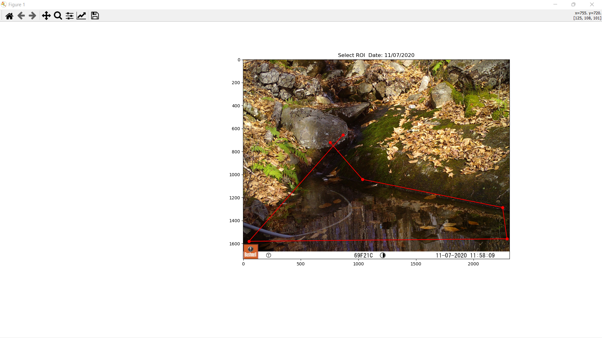
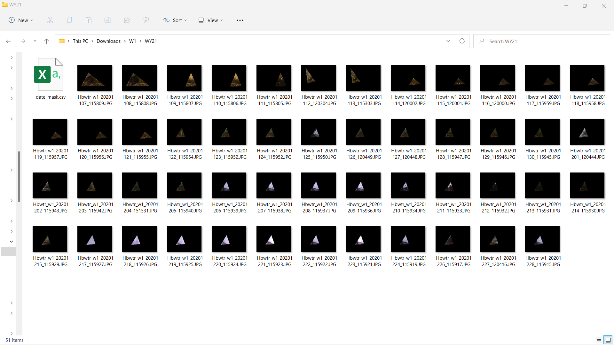
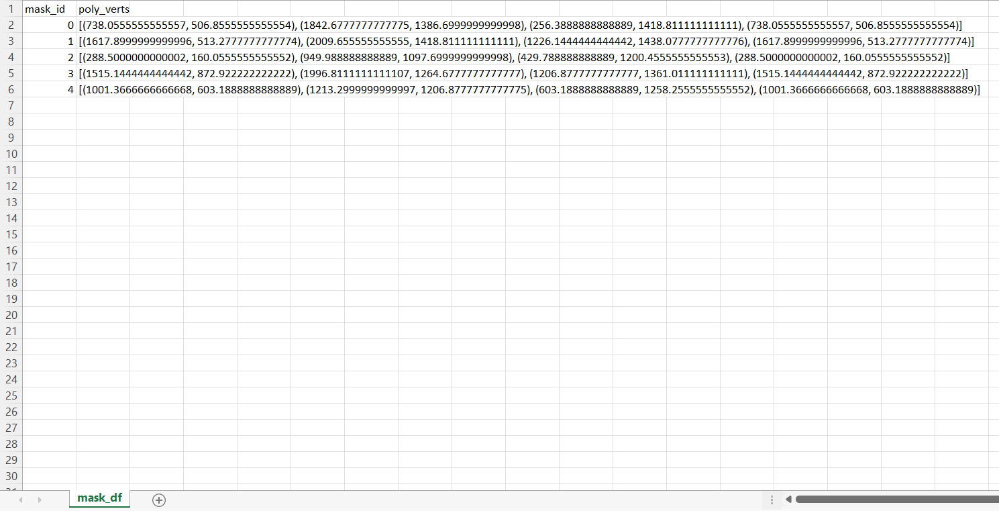

# Selecting Region of Interest

This chapter provides an overview about the Python scripts used to create a polygonal region of interest and mask for images contained in folders. Before beginning this section, ensure that all image files are properly named.

`interactive_ROI_app.py` is the script used to create a region of interest and mask for images within a folder.

## RoiPoly Functionality

`RoiPoly`[^1] is the python module from which our mouse click events are handled. The functions within this script allow the user to create an ROI by drawing a polygon with mouse clicks. A point is drawn by left clicking, from which a line is bounded to, extending to the user cursor. By left-clicking again, a new point is created and the line becomes static. A new line is again shown from the last point to the user cursor. To complete a figure, the user simply right or double clicks, bounding the last selected point to the first. The polygon created within the image is the region of interest.

## Preliminary Data Collection 

This section details the functions in this script not directly related to plotting and buttons (change description).

### Import necessary packages

Load in all necessary packages. In the making and testing of our script, we have found that the "`Qt5Agg`" backend works best for Windows system while the "`MacOSX`" backend works best for Apple. These backends allow us to work interactively with the python plotting library `matplotlib`. For more information, visit `matplotlib`'s official website.[^2]

```{python load-python-packages2, eval = FALSE}
import re
import matplotlib as mpl
import os.path
import pandas as pd
from PIL import Image

mpl.use('Qt5Agg')  # backend
import cv2
from roipoly import RoiPoly
import glob2
import numpy as np
import matplotlib.pyplot as plt
from matplotlib.widgets import Button
from collections import OrderedDict
from matplotlib.path import Path as MplPath
```

### Loading Image Folder

Our script denotes the file path to a folder and stores it in a variable `folder_path`. Change the example path to the path of the folder for which to operate on. We then use the `.glob` function of the `glob` package to store the file path for each image into the variable `image_folder`.

```{python load-image-folder, eval = FALSE}
folder_path = r"\Example\Path\To\Folder"
image_folder = glob2.glob(folder_path + "/*")
```

### ImageFile Class

Within this script is a class named `ImageFile`, from which an object containing information from a specified filepath is to be created.


```{python image_file_lass, eval = FALSE}
class ImageFile:
    """ Image File class to save file path, file name, date, mask_id"""

    def __init__(self, filename):
        self.path = filename
        self.image_name = filename.split("\\")[-1]
        self.date = self.get_date()
        self.mm, self.dd, self.yy = self.date.split("/")
        self.mask_id = None

    def get_date(self):
        """
        extracts date pattern (MM/DD/YY) from file name (eg. Hbwtr_w3_20200315_115918.JPG)
        :return: date
        """
        date_pattern = "\d{8}"  # eg 12-12-2020
        date = re.search(date_pattern, self.path).group(0)
        dd, mm, yy = date[-2:], date[-4:-2], date[-8:-4]
        date = mm + '/' + dd + '/' + yy
        return date

    def get_water_year(self):
        """
        extracts water year from dates
        """
        if self.mm >= "10" or self.mm <= "12":
            return int(self.yy[-2:]) + 1
        return int(self.yy[-2:])

    def read_img_orig(self):
        """
        reads image path and returns original image(np.array)
        """
        return np.asarray(Image.open(self.path))

    def read_img_sliced(self):
        """
        reads image path and returns sliced image(np.array) for faster display
        select every other row and columns and return sliced image
        """
        img = self.read_img_orig()
        return img[::2, ::2]
```

### Image File Object List

A list with complete information of every jpg in image_folder is appended to `image_file_list`, which is then sorted and made to a list of arrays for plotting purposes.

```{python sort-image-folder, eval = FALSE}
image_file_list = []
for filename in image_folder:
    filetype = filename[-4:]
    # Check if the file name ends with ".JPG" or ".jpg"
    if filetype.lower() != ".jpg":
        continue
    curr_IF = ImageFile(filename)
    image_file_list.append(curr_IF)

# sort by year, then month, then day
image_file_list = np.array(sorted(image_file_list, key=lambda x: (x.yy, x.mm, x.dd)))

```

## First ROI and Masking Function

This section details the user process and functions needed for image plotting and the associated interactive buttons.

### Creating First Region of Interest
The first image file object in image_file_object_list is plotted, allowing the user to create the first region of interest and mask (see section 2.1 `RoiPoly` for instruction).

```{r image-mid-creation, echo = FALSE}

```

## Masking

Each selected point in a created polygon is stored into `poly_verts`, which is used to create the mask outline for the region of interest.

```{python get_mask, eval = FALSE}
def get_mask_poly_verts(image, poly_verts, on_original=False):
    """
    :param image: np.array of image
    :param poly_verts: list of  coordinates from ROI selection
    :param on_original: boolean indicating if the mask is applied to riginal or sliced image
    :return: image mask that can be applied to image
    """
    if len(np.shape(image)) == 3:
        ny, nx, nz = np.shape(image)
    else:
        ny, nx = np.shape(image)
    # if mask is applied to original, each coordinate is multiplied by 2
    if on_original:
        poly_verts = [(2 * x, 2 * y) for (x, y) in poly_verts]

    x, y = np.meshgrid(np.arange(nx), np.arange(ny))
    x, y = x.flatten(), y.flatten()
    points = np.vstack((x, y)).T
    roi_path = MplPath(poly_verts)
    mask = roi_path.contains_points(points).reshape((ny, nx))
    return mask
```

We use boolean algebra to apply the mask onto the image, making everything outside of the region of interest black.

```{python apply_mask, eval = FALSE}
def apply_mask(im, mask):
    """
    :param im: image np.array
    :param mask: np.array of the same size to mask
    :return: return masked image
    """
    im[mask != 1] = 0
    return im

```

### Button Events
This section details instruction and function for each interactive button event. These buttons are part of `matplotlib`'s `Button` module. Creating one requires an event function, as well as button initialization as seen below for the `Confirm` button.

```{python initalizing_button, eval = FALSE}
confirm_ax = plt.axes([0.81, 0.05, 0.1, 0.075])
confirm_button = Button(confirm_ax, 'Confirm')
confirm_button.on_clicked(confirm_roi)
confirm_button._button = confirm_button
```

#### Confirm Button
After creating a region of interest, the user must click confirm to proceed and apply the mask.
```{r image-confirm-button, echo = FALSE}
knitr::include_graphics("./imgs/confirmbutton.png")

```

The `confirm_roi` event allows the user to confirm the selected ROI.
```{python confirm-button, eval = FALSE}
def confirm_roi(event):
    """
    Callback event for confirm button
    If users select ROI and hit confirm, save the poly_verts and apply it to the rest of images
    Then, start showing next and previous buttons
    """

    # save current mask's poly_verts starting from start_img_ind index
    for i in range(start_img_ind, len(image_file_list)):
        poly_verts_list[i] = curr_poly_verts

    img_display_axis.set_title("Choose next or redraw ROI for {}".format(image_file_list[start_img_ind].date))
    # button to show next and prev masked images
    _ = show_next_prev()

```

#### Restart Masking Button
To create a new region of interest, the user must click restart masking. The user should then create a new region of interest and confirm to proceed to apply the new mask. After creating a new ROI, the user has the option to confirm or to restart and draw a new ROI.

```{r image-restart-masking, echo = FALSE}
knitr::include_graphics("./imgs/restartmasking.png")

```

The underlying dynamics of the `restart_masking` can be seen here.
```{python restart-masking-button, eval = FALSE}
def restart_masking(event):
    """
    :param event: Callback event when user restarts masking
    Clears plot and begin a new ROI masking session
    """
    global my_roi, confirm_button, restart_masking_button, img_display, img_display_axis, start_img_ind, curr_mask, curr_poly_verts

    # clear plot
    plt.clf()
    # create new plot
    fg_2 = plt.gcf()
    fg_2.subplots_adjust(left=0.3, bottom=0.25)
    fg_2.set_size_inches(w, h, forward=True)

    # change the content of image on curr axis
    img_display_axis = plt.gca()
    if not callback.index_in_range():
        print("OUT OF RANGE")
        return
    curr_ind = callback.index
    curr_obj = image_file_list[curr_ind]
    img_display_axis.set_title("Confirm ROI? Date: {}".format(curr_obj.get_date()))
    img_display = img_display_axis.imshow(curr_obj.read_img_sliced())
    # display new ROI pop up
    my_roi = RoiPoly(color='r', close_fig=False)

    # wait until the user finishes selecting ROI
    while not my_roi.finished_clicking:
        plt.pause(0.01)

    # mask current image and display
    cp = curr_obj.read_img_sliced().copy()
    curr_mask, curr_poly_verts = my_roi.get_mask(cp)
    cp = apply_mask(cp, curr_mask)
    start_img_ind = curr_ind
    img_display = img_display_axis.imshow(cp)

    # Create a confirm mask button for new session
    confirm_ax = plt.axes([0.81, 0.05, 0.1, 0.075])
    confirm_button = Button(confirm_ax, 'Confirm')
    confirm_button.on_clicked(confirm_roi)
    confirm_button._button = confirm_button

    # Create a restart mask button for new session
    restart_masking_ax = plt.axes([0.1, 0.05, 0.3, 0.075])
    restart_masking_button = Button(restart_masking_ax, "Restart masking")
    restart_masking_button.on_clicked(restart_masking)

    plt.draw()

```

#### Next and Previous Button

The next and previous buttons allow the user to click through images in the folder with the mask overlaid. These are part of the callback function `Callback`, which makes sliding through a folder possible through indexing.

```{r image-previous-next-button, echo = FALSE}
knitr::include_graphics("./imgs/previousnext.jpg")

```

By indexing, each image is drawn with its associated date in the figure title.

```{python next_prev_buttons, eval = FALSE}
def next(self, event):
    """
    :param event: event callback for matplotlib button
    Slide to the next image in folder and display it
    """
    self.index += 1
    if not self.index_in_range():
        print("Reached End of Folder")
        self.index -= 1
        return
    im = self.get_masked_img()
    img_display.set_data(im)
    img_display_axis.set_title("Click next or draw new ROI for Date: {}".format(image_file_list[self.index].get_date()))
    plt.draw()

def prev(self, event):
    """
    :param event: event callback for matplotlib button
    Slide to the previous image in folder and display it
    """
    self.index -= 1
    if not self.index_in_range():
        print("Reached Start of Folder")
        self.index += 1
        return

    im = self.get_masked_img()
    img_display.set_data(im)
    img_display_axis.set_title("Click next or draw new ROI for Date: {}".format(image_file_list[self.index].get_date()))
    plt.draw()
```


#### Finish Masking Button

Once masking has been complete, click "finish masking" to close the figure. This button event also creates the water year folders, a dataframe linking every `mask_id` to its associated mask, a dataframe linking date of image to `mask_id`, and apply's the mask onto the full size original image.

```{r image-finish-button, echo = FALSE}
knitr::include_graphics("./imgs/finishmasking.jpg")

```

This event is slow and hefty, expect a long processing time.
```{python finsh_masking, eval = FALSE}
def finish_masking(event):
    """
        :param event: Callback event for finish masking button
        save dataframe linking mask_id to actual mask  (mask_df)
        create water year folders
        save dataframe linking date to mask_id (date_mask_df)
        apply masks on original images and save them in their respective water year folders
        close plot
    """
    global poly_verts_list

    # collect unique poly_verts and assign mask_ids to them
    poly_verts_unique_list = []
    mask_id = -1
    for i in range(len(poly_verts_list)):
        if mask_id == -1 or poly_verts_list[i - 1] != poly_verts_list[i]:
            mask_id += 1
            poly_verts_unique_list.append(poly_verts_list[i])
        # assign mask_ids to all ImageFile objects
        image_file_list[i].mask_id = mask_id

    # Save a mask_df data frame with columns mask_id-> actual mask(poly_verts) and save it
    mask_df = pd.DataFrame(list(zip(poly_verts_unique_list)), columns=["poly_verts"])
    mask_df.index.name = "mask_id"
    mask_df_dst = folder_path + "/" + "mask_df.csv"
    mask_df.to_csv(mask_df_dst)
    # print(mask_df.head())

    # collect all information from ImageFile Objects
    image_file_info = pd.DataFrame(
        [(i.date, i.mask_id, i.path, i.get_water_year(), ind, poly_verts_list[ind]) for ind, i in
         enumerate(image_file_list)],
        columns=["Date", "mask_id", "file_path", "WY", "list_index", "poly_verts"])
    image_file_info.set_index("WY", inplace=True)
    # print(image_file_info.head())

    # list of water years
    list_wy = list(image_file_info.index.unique())
    print("STARTED SAVING")
    print("This takes about 1 second per an image file")


    for water_year in list_wy:
        # Create folders for each water year
        wy_dest = folder_path + "/" + "WY" + str(water_year)
        if not os.path.exists(wy_dest):
            os.mkdir(wy_dest)
        # loop through index of image_file_objects and save original images with their mask
        df = image_file_info[image_file_info.index == water_year]

        # save a date_mask dataframe with columns date-> mask_id -> file name
        date_mask_df = df.reset_index()[["Date", "mask_id"]].set_index("Date")
        date_mask_df.to_csv(wy_dest + "/" + "date_mask.csv")

        # mask images within a selected water_year
        for index, row in df.iterrows():
            folder_index = row["list_index"]
            curr_file_path = row["file_path"]

            # save masked image to WY destination
            curr_obj = image_file_list[folder_index]
            curr_file_name = curr_obj.image_name
            curr_original_image = curr_obj.read_img_orig().copy()
            curr_original_mask = get_mask_poly_verts(curr_original_image, poly_verts_list[folder_index],
                                                     on_original=True)
            curr_original_image = apply_mask(curr_original_image, curr_original_mask)
            curr_img_save_dest = wy_dest + "/" + curr_file_name

            # save curr_original_image
            Image.fromarray(np.array(curr_original_image)).save(curr_img_save_dest)

    print("FINISHED SAVING")
    plt.close()

```

### Output

The output from interactive_ROI_app.py consists of sorted wateryear folders containing masked images, a dataframe linking every `mask_id` to its associated mask, and a dataframe linking date of image to `mask_id`.

#### Example Wateryear Output

Here is an example wateryear folder containing masked images.

```{r wateryear-folder, echo = FALSE}


```

#### Example Output for Dataframes

Here is an example dataframe that stores each `mask_id` to its associated mask.

```{r Dataframe-id-mask, echo = FALSE}


```

Here is an example dataframe that stores each `mask_id` to its associated date.

```{r Dataframe-date-id, echo = FALSE}
knitr::include_graphics("./imgs/date_mask_csv_example.png")

```

[^1]: Our version of RoiPoly is derived from jdoepfert's roipoly.py, whose module can be found on at "https://github.com/jdoepfert/roipoly.py"

[^2]: Information of matplotlib backends can be found at https://matplotlib.org/stable/users/explain/backends.html