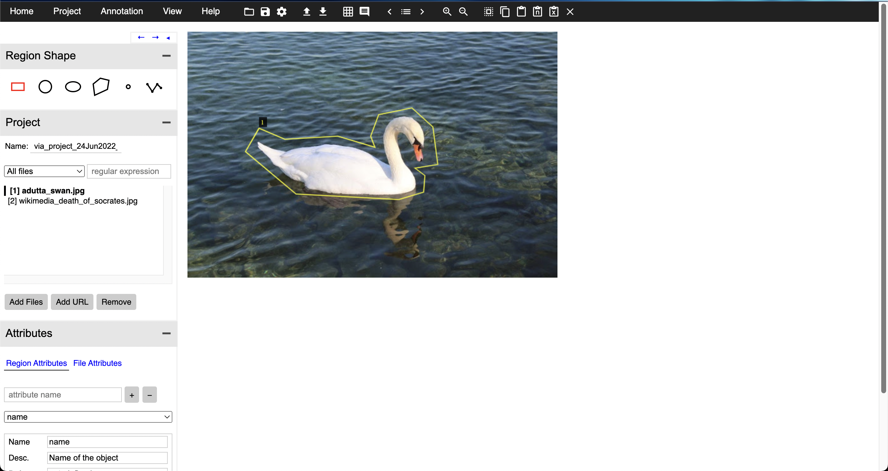
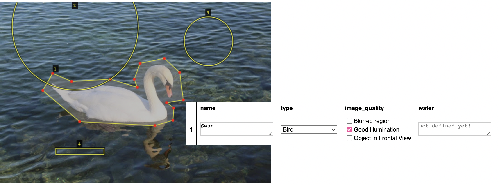

# Classifying Image Attributes with VIA

After completing image masking, the next step is done entirely in VGG Image Annotator.
This is an HTML software found online, and the demo can be accessed [here](https://www.robots.ox.ac.uk/~vgg/software/via/via_demo.html). It should look like this:

```{r knitr-via-preview, echo=FALSE}

```


## Creating Project

If a project already exists, navigate to the project tab in the menu bar and click
load project to load in a preexisting .json file. Otherwise, remove the demo images
and upload your own images using **add files**. 

At any point during annotation, these files may be saved into a .json project using
**Project > Save** from the menu bar.

## Creating Attributes

To create attributes for pixel classification, navigate to the bottom left-hand side
of the screen to name and assign characteristics for the attribute. 

In our project, the classified images outputted from VIA became the *training data* for the machine learning model to classify snow, ice, and leaf cover. Our project used 12 different attributes,
including `ice_t` (transparent ice), `leaf_green`, `leaf_fall`, `open_water`, and
`snow_o` (opaque snow), among others. 

To load the attributes that we used in our project, clicking this [link](./imgs/hbwater_cameratrap_demo.json) will open a text file. Copy the contents
of this file and save it as a `.json` file. Then, select load project from the menu bar,
and upload the `.json` file.

## Classify Pixels

Classify pixels by dragging and clicking on the image to create boxes or shapes
using the desired **region shape**, and then assigning them to attributes.
Repeat this process for all images in the folder, and export your annotations as a 
`.json` or `.csv` file. See below for an example using VIA's demo file.

```{r knitr-via-demo, echo=FALSE}

```

If you must stop midway, save your project by clicking on the **Settings** pane
in the menu bar and following the instructions. This will allow you to load in
your previously saved progress directly in the future.


