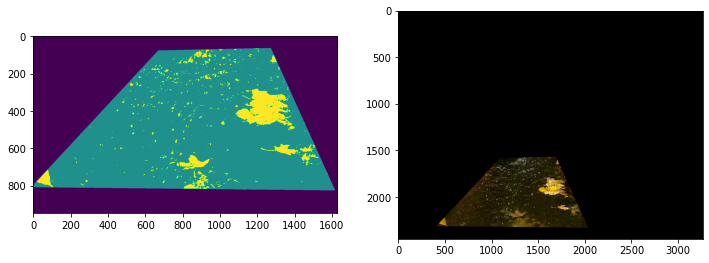

# Random Forest Image Classification

The last step in the data pipeline is to run a random forest model to classify images.
Below are some outputs generated by the model, indicating a high degree of accuracy
in identifying leaf cover. The image on the right is the original masked image,
whereas the image on the left is the ML output showing water in teal and leaves in gold.

```{r machine-learning-image, echo=FALSE}


```
 
 